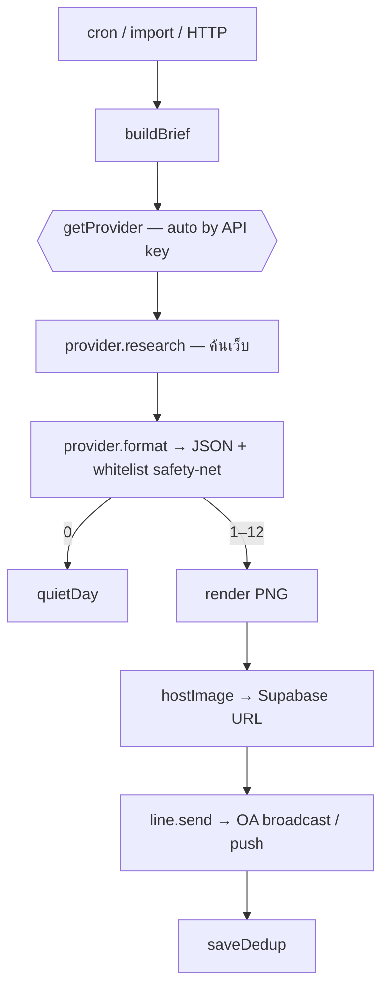

# Tech Brief Agent — Handoff (v1.2)

> Daily Tech/AI news brief. An AI agent (**Claude / OpenAI / Gemini / Groq / Qwen**)
> ค้นเว็บเปิดหาข่าว → กรองเหลือเฉพาะสำนักข่าวใน whitelist → สรุปไทย → เรนเดอร์
> **infographic dark-brutalist KTIS X** เป็น PNG → **ส่งเข้า LINE Official Account**.
> Pluggable: ใช้เป็น library / HTTP endpoint / standalone ก็ได้.
>
> เอกสารนี้ self-contained — โค้ดครบทุกไฟล์อยู่ท้าย (ยกเว้นหน้า viewer ซึ่งอยู่ใน zip)
> เปิดในอีกเครื่อง/Claude Code แล้วสั่งต่อได้ทันที

**ใหม่ใน v1.2**
- **Multi-provider AI** — รองรับ Claude, OpenAI, Gemini, Groq, Qwen · **auto-เลือก provider ที่กรอก API key ไว้** (บังคับได้ด้วย `AI_PROVIDER`) · แต่ละค่ายใช้ web search ของตัวเอง
- **LINE Official Account** — ส่งแบบ **broadcast หาผู้ติดตาม OA ทั้งหมด** เป็นค่า default (ไม่ต้องใช้ group id อีก) · สลับเป็น `push` หา id เฉพาะได้
- **v1.1 เดิม:** core `buildBrief()` แยกจากการส่ง (pluggable) · agent 2-เฟส + retry

---

## 0. Multi-provider AI (auto-select by key)

ตั้ง **อย่างน้อย 1 key** ใน `.env` แล้ว agent เลือกให้เอง (ลำดับความสำคัญเมื่อมีหลาย key: `anthropic > openai > gemini > groq > qwen`) หรือบังคับด้วย `AI_PROVIDER`

| provider | key env | ค้นข่าวด้วย (research) | หมายเหตุ |
|---|---|---|---|
| anthropic | `ANTHROPIC_API_KEY` | `web_search` tool | ค่าเริ่มต้นเดิม |
| openai | `OPENAI_API_KEY` | `gpt-4o-search-preview` | model สาย search |
| gemini | `GEMINI_API_KEY` | `google_search` grounding | key ส่งทาง header |
| groq | `GROQ_API_KEY` | `groq/compound` | compound มี web search |
| qwen | `DASHSCOPE_API_KEY` | `enable_search` (DashScope) | intl endpoint |

โครง: `src/providers/<name>.js` แต่ละตัว export `research(system,user)` + `format(system,user)` · `src/providers/index.js` เป็นตัวเลือก provider · `agent.js` เรียกผ่าน interface นี้ (2-เฟส: research ค้นเว็บ → format เป็น JSON) เพราะฉะนั้น **เพิ่มค่ายใหม่ = เพิ่มไฟล์เดียว**

> ⚠️ กลไก web search ของแต่ละค่าย **ต่างกันและเปลี่ยนได้** (ชื่อ model/พารามิเตอร์) — verify ที่ docs ของค่ายนั้นก่อนใช้จริง โค้ดใส่ค่า default ที่สมเหตุสมผลไว้ให้แล้ว รันในเครื่องนี้ผมทดสอบ network ไม่ได้

---

## 1. LINE Official Account

`src/line.js` → `.send(messages)` เลือกตามโหมด:
- **`LINE_SEND_MODE=broadcast`** (default) → `client.broadcast()` ยิงหาผู้ติดตาม OA ทั้งหมด — **ไม่ต้องมี target id**
- `LINE_SEND_MODE=push` → `client.pushMessage({to})` หา `LINE_TARGET_ID` เฉพาะ (user/group/room)

ต้องมี `LINE_CHANNEL_ACCESS_TOKEN` ของ OA เสมอ · broadcast มี **โควตาข้อความ/เดือน** ของ OA (free tier จำกัด) — เช็คแพลนก่อนใช้จริง

---

## 2. Spec (จาก grilling) + flow

- Discovery = **agentic web search เว็บเปิด** (provider ที่เลือก) · หัวข้อ **broad tech** (AI/Startup/Funding/Policy/Gadget) · recency ~24 ชม.
- จำนวน **3–12** (floor/ceiling) · **whitelist reputable เท่านั้น** (global + ไทย) · บทบาท = **search ทั้งเว็บ ตีพิมพ์เฉพาะที่ whitelist รายงาน**
- **กันซ้ำข้ามวัน** (fingerprint ใน Supabase ~7 วัน)
- Output = **infographic PNG** ตัวจบ (ไม่ต้องกดลิงก์) · ยืดสูงอัตโนมัติ · **ไทย + ศัพท์ EN** · ดีไซน์ **KTIS X** (`#0a0a0a`/`#f5f5f5`/red `#ee1b24`, Kanit, grain, aura)
- ส่ง **LINE OA** · host รูป **Supabase Storage** · runtime **GitHub Actions** cron ~07:00 ICT
- Edge: 1–2 ข่าว→ส่งเท่าที่มี · 0 ข่าว→การ์ด "เงียบ" · พัง→แจ้ง owner ส่วนตัว ไม่ยิงเข้าช่องหลัก + exit 1



---

## 3. โครงไฟล์

```text
tech-brief-agent/
├── package.json                 # main → src/api.js
├── .env.example                 # provider keys + LINE OA + supabase
├── config/sources.js            # whitelist (global + ไทย) + categories
├── src/
│   ├── api.js          ★ public exports (จุด import เดียว)
│   ├── brief.js        ★ buildBrief() — core, คืนผลลัพธ์ (+ provider ที่ใช้)
│   ├── agent.js          2-เฟส ผ่าน provider interface
│   ├── providers/      ★ multi-AI
│   │   ├── index.js        auto-select provider ตาม key
│   │   ├── anthropic.js    Claude (web_search)
│   │   ├── openai.js       OpenAI (search-preview)
│   │   ├── gemini.js       Gemini (google_search)
│   │   ├── groq.js         Groq (compound)
│   │   └── qwen.js         Qwen (DashScope enable_search)
│   ├── deliver.js        toLineMessages() / quietDayText()
│   ├── run.js            standalone runner (cron entry)
│   ├── render.js         Puppeteer HTML → PNG
│   ├── template.js       infographic KTIS X
│   ├── storage.js        hostImage()/publishLatest() (Supabase)
│   ├── dedup.js          getDedupRecent()/saveDedup()
│   ├── line.js           LINE OA transport (broadcast/push)
│   └── config.js         env + provider registry + asserts
├── integration/
│   ├── use-as-module.mjs ตัวอย่างเสียบเข้า Node sender เดิม
│   └── server.mjs        HTTP endpoint (ภาษาอื่น)
├── viewer/pixel-monitor.html    หน้า RPG ดู agent ทำงาน (อยู่ใน zip)
├── supabase/schema.sql          dedup table + public bucket
└── .github/workflows/daily-brief.yml   cron 07:00 ICT
```

---

## 4. Setup

**Prereq:** Node ≥ 20 · อย่างน้อย 1 AI provider key · LINE OA (Messaging API) · Supabase

1. **AI:** ใส่ key อย่างน้อย 1 ตัวใน `.env` (ANTHROPIC/OPENAI/GEMINI/GROQ/DASHSCOPE) — agent เลือกให้เอง
2. **Supabase:** SQL Editor → รัน `supabase/schema.sql` → เก็บ `SUPABASE_URL` + service_role key
3. **LINE OA:** สร้าง Messaging API channel ของ OA → `LINE_CHANNEL_ACCESS_TOKEN` · โหมด default = broadcast (ไม่ต้องหา id)
4. **เทสในเครื่อง:**
```bash
npm install
npx puppeteer browsers install chrome
cp .env.example .env      # ใส่ key
npm run dry-run           # agent + render → sample.png (ไม่แตะ LINE/Supabase)
```
5. **Deploy standalone:** push → GitHub → Actions Secrets → รันเอง 07:00 ICT (หรือ Run workflow เทสทันที)
6. **เสียบเข้าระบบพี่:** เรียก `buildBrief()` จากโค้ดพี่ (แบบ A) หรือ `npm run serve` (แบบ B)

---

## 5. Config knobs

| ตัวแปร | default | ทำอะไร |
|---|---|---|
| `AI_PROVIDER` | (auto) | บังคับ provider: anthropic/openai/gemini/groq/qwen |
| `MODEL_<PROVIDER>` / `SEARCH_MODEL_<PROVIDER>` | ต่อค่าย | override model |
| `MAX_SEARCHES` / `MAX_TOKENS` | `18` / `8192` | คุม cost / output |
| `MIN/MAX_STORIES` | `3`/`12` | floor/ceiling |
| `LINE_SEND_MODE` | `broadcast` | `broadcast` (OA followers) / `push` (+`LINE_TARGET_ID`) |
| `SEND_LINE` / `HOST_IMAGE` | on | `0` = ให้พี่ส่ง / host เอง |
| `PUBLISH_LATEST` | off | `1` = เขียนแถว latest_brief |
| `DEDUP_WINDOW_DAYS` | `7` | กันซ้ำย้อนหลัง |

---

## 6. แก้ตรงไหน
- เพิ่ม AI ค่ายใหม่ → ไฟล์เดียวใน `src/providers/` + ลงทะเบียนใน `index.js`
- สำนักข่าว → `config/sources.js` · หมวด → `CATEGORIES`
- ดีไซน์รูป → `src/template.js` · prompt → `researchSystem()`/`formatSystem()` ใน `agent.js`
- เวลา/ช่องส่ง → `.github/workflows/daily-brief.yml` · `LINE_SEND_MODE`

## 7. ⚠️ ก่อน deploy
- **web search ต่อค่าย** (ชื่อ model/พารามิเตอร์) เปลี่ยนได้ — verify docs ของค่ายที่ใช้
- Claude `web_search_20250305` + ชื่อโมเดล — เช็ค docs.claude.com
- **service_role key** อยู่ server เท่านั้น · **bucket public** · broadcast มีโควตา/เดือนของ OA

---

# Full source
> ทุกไฟล์อยู่ด้านล่าง — path = หัวข้อ (viewer/pixel-monitor.html ดูใน zip)

### `package.json`

````json
{
  "name": "tech-brief-agent",
  "version": "1.1.0",
  "description": "Daily Tech/AI news brief — Claude agentic web-search → dark-brutalist infographic. Pluggable: use as a library, an HTTP endpoint, or a standalone LINE sender.",
  "type": "module",
  "main": "src/api.js",
  "exports": {
    ".": "./src/api.js",
    "./run": "./src/run.js"
  },
  "scripts": {
    "start": "node src/run.js",
    "dry-run": "DRY_RUN=1 node src/run.js",
    "serve": "node integration/server.mjs",
    "example": "node integration/use-as-module.mjs"
  },
  "engines": { "node": ">=20" },
  "license": "MIT",
  "dependencies": {
    "@anthropic-ai/sdk": "^0.115.0",
    "@line/bot-sdk": "^11.2.0",
    "@supabase/supabase-js": "^2.111.0",
    "dotenv": "^17.4.2",
    "puppeteer": "^25.4.0"
  }
}

````

### `.env.example`

````bash
# ============ Tech Brief Agent — environment ============
# Copy to `.env` for local runs. In GitHub Actions use repo Secrets/Variables.

# ---------- AI provider (set AT LEAST ONE key) ----------
# The agent auto-picks the provider whose key is set. Priority when several are
# set: anthropic > openai > gemini > groq > qwen. Force one with AI_PROVIDER.
# AI_PROVIDER=anthropic        # optional: anthropic | openai | gemini | groq | qwen

ANTHROPIC_API_KEY=              # Claude   (web_search tool)
OPENAI_API_KEY=                 # OpenAI   (gpt-4o-search-preview)
GEMINI_API_KEY=                 # Gemini   (google_search grounding)
GROQ_API_KEY=                   # Groq     (groq/compound web search)
DASHSCOPE_API_KEY=              # Qwen     (DashScope, enable_search)

# optional per-provider model overrides (uppercased provider name):
# MODEL_ANTHROPIC=claude-sonnet-5
# MODEL_OPENAI=gpt-4o-mini        SEARCH_MODEL_OPENAI=gpt-4o-search-preview
# MODEL_GEMINI=gemini-2.0-flash
# MODEL_GROQ=openai/gpt-oss-120b   SEARCH_MODEL_GROQ=groq/compound
# MODEL_QWEN=qwen-plus            QWEN_BASE_URL=https://dashscope-intl.aliyuncs.com/compatible-mode/v1

MAX_SEARCHES=18                 # cap web searches per run (cost guard; Claude)
MAX_TOKENS=8192                 # agent output token budget

# ---------- brief shape ----------
MIN_STORIES=3
MAX_STORIES=12
RECENCY_HOURS=24
TZ_LABEL=Asia/Bangkok

# ---------- LINE Official Account ----------
LINE_CHANNEL_ACCESS_TOKEN=      # OA Messaging API channel access token
LINE_SEND_MODE=broadcast        # broadcast = all OA followers (no id needed) | push
LINE_TARGET_ID=                 # only for push mode (user/group/room id)
LINE_OWNER_ID=                  # optional: your user id for failure alerts

# ---------- Supabase (image hosting + dedup) ----------
SUPABASE_URL=
SUPABASE_SERVICE_ROLE_KEY=      # service_role key (server-side only!)
SUPABASE_BUCKET=tech-brief      # public bucket
SUPABASE_DEDUP_TABLE=sent_stories
DEDUP_WINDOW_DAYS=7

# ---------- integration / delivery mode ----------
# SEND_LINE=0        -> do NOT send from this project (parent system sends)
# HOST_IMAGE=0       -> do NOT upload to Supabase (you host the buffer yourself)
# PUBLISH_LATEST=1   -> also write latest brief (url+stories) to a Supabase row
# PORT=8787          -> HTTP endpoint (integration/server.mjs)   BRIEF_TOKEN=secret
# DRY_RUN=1          -> agent + render sample.png locally, skip LINE/Supabase

````

### `.gitignore`

````text
node_modules/
.env
sample.png
sample.json
*.log
.DS_Store

````

### `config/sources.js`

````javascript
// ---------------------------------------------------------------------------
// WHITELIST — the credibility gate.
// The agent searches the WHOLE open web, but a story is only ever published if
// its source URL belongs to one of these domains. Edit freely.
// (index.js re-checks every story's domain against this list as a safety net,
//  so the whitelist here is the single source of truth.)
// ---------------------------------------------------------------------------

export const WHITELIST = {
  global: [
    { name: "TechCrunch",            domain: "techcrunch.com" },
    { name: "The Verge",             domain: "theverge.com" },
    { name: "Ars Technica",          domain: "arstechnica.com" },
    { name: "Wired",                 domain: "wired.com" },
    { name: "Engadget",              domain: "engadget.com" },
    { name: "Reuters",               domain: "reuters.com" },
    { name: "Bloomberg",             domain: "bloomberg.com" },
    { name: "The Information",       domain: "theinformation.com" },
    { name: "MIT Technology Review", domain: "technologyreview.com" },
    { name: "VentureBeat",           domain: "venturebeat.com" },
    // Official / primary sources
    { name: "OpenAI",                domain: "openai.com" },
    { name: "Google",                domain: "blog.google" },
    { name: "Google DeepMind",       domain: "deepmind.google" },
    { name: "Anthropic",             domain: "anthropic.com" },
    { name: "Meta AI",               domain: "ai.meta.com" },
    { name: "Microsoft",             domain: "blogs.microsoft.com" },
    { name: "arXiv",                 domain: "arxiv.org" },
  ],
  thai: [
    { name: "Blognone",              domain: "blognone.com" },
    { name: "Beartai",               domain: "beartai.com" },
    { name: "Techsauce",             domain: "techsauce.co" },
    { name: "Thumbsup",              domain: "thumbsup.in.th" },
    { name: "Droidsans",             domain: "droidsans.com" },
  ],
};

// Story categories shown as red chips on the infographic.
export const CATEGORIES = ["AI", "Startup", "Funding", "Policy", "Gadget"];

export const ALL_SOURCES = [...WHITELIST.global, ...WHITELIST.thai];
export const WHITELIST_DOMAINS = ALL_SOURCES.map((s) => s.domain);

// Given a URL, return the matching whitelisted source (or null).
export function matchSource(url) {
  if (!url) return null;
  let host;
  try {
    host = new URL(url).hostname.replace(/^www\./, "").toLowerCase();
  } catch {
    return null;
  }
  return (
    ALL_SOURCES.find((s) => host === s.domain || host.endsWith("." + s.domain)) ||
    null
  );
}

````

### `src/api.js`

````javascript
// ============================================================================
//  Public API — import this to plug the brief into another Node system.
//
//    import {
//      buildBrief, hostImage, toLineMessages,
//      getDedupRecent, saveDedup, publishLatest,
//    } from "tech-brief-agent";
//
//  Typical wiring into an EXISTING LINE sender:
//
//    const recent = await getDedupRecent();               // optional
//    const brief  = await buildBrief({ recent });
//    const url    = brief.image ? await hostImage(brief.image.buffer, brief.image.filename)
//                               : null;                    // or use YOUR own hosting
//    const messages = toLineMessages({ quietDay: brief.quietDay, imageUrl: url });
//    await yourLineClient.pushMessage({ to: YOUR_TARGET, messages });   // ← their sender
//    if (!brief.quietDay) await saveDedup(brief.stories); // optional
// ============================================================================

export { buildBrief } from "./brief.js";
export { hostImage, publishLatest } from "./storage.js";
export { getDedupRecent, saveDedup, fingerprint } from "./dedup.js";
export { toLineMessages, quietDayText } from "./deliver.js";
export { runAgent } from "./agent.js";
export { renderPng } from "./render.js";
export { CONFIG } from "./config.js";
export { getProvider, selectProviderName } from "./providers/index.js";
export {
  WHITELIST,
  CATEGORIES,
  ALL_SOURCES,
  WHITELIST_DOMAINS,
  matchSource,
} from "../config/sources.js";

````

### `src/brief.js`

````javascript
import { runAgent } from "./agent.js";
import { renderPng } from "./render.js";
import { CONFIG } from "./config.js";

const ymd = (d) =>
  new Intl.DateTimeFormat("en-CA", {
    year: "numeric",
    month: "2-digit",
    day: "2-digit",
    timeZone: CONFIG.brief.tzLabel,
  }).format(d);

/**
 * Generate today's brief. PURE — no LINE, no upload. The caller decides how to
 * deliver. Pass `recent` (from getDedupRecent) so it won't repeat past stories.
 *
 * returns {
 *   quietDay: boolean,           // true = no qualifying stories today
 *   date: Date,
 *   stories: Story[],            // [] when quietDay
 *   image: { buffer, filename, contentType } | null   // null when quietDay
 * }
 */
export async function buildBrief({ recent = [] } = {}) {
  const date = new Date();
  const { stories, provider } = await runAgent({ recent });

  if (stories.length === 0) {
    return { quietDay: true, date, stories: [], image: null, provider };
  }

  const buffer = await renderPng(stories, {
    date,
    count: stories.length,
    tz: CONFIG.brief.tzLabel,
  });

  return {
    quietDay: false,
    date,
    stories,
    provider,
    image: { buffer, filename: `brief-${ymd(date)}.png`, contentType: "image/png" },
  };
}

````

### `src/agent.js`

````javascript
import { CONFIG } from "./config.js";
import { WHITELIST, CATEGORIES, matchSource } from "../config/sources.js";
import { getProvider } from "./providers/index.js";

const sleep = (ms) => new Promise((r) => setTimeout(r, ms));
async function withRetry(fn, tries = 3) {
  let last;
  for (let i = 0; i < tries; i++) {
    try { return await fn(); }
    catch (err) {
      last = err;
      const s = err?.status ?? err?.response?.status;
      const msg = err?.message || "";
      const transient = s === 429 || s === 529 || (s >= 500 && s < 600) || /429|5\d\d|network|timeout|ECONN|fetch failed/i.test(msg);
      if (!transient || i === tries - 1) throw err;
      await sleep(1000 * 2 ** i);
    }
  }
  throw last;
}

function whitelistBlock() {
  const l = (s) => `- ${s.name} (${s.domain})`;
  return ["GLOBAL:", ...WHITELIST.global.map(l), "", "THAI:", ...WHITELIST.thai.map(l)].join("\n");
}

// ---- Phase 1: research (provider searches the open web) ----
function researchSystem() {
  const { recencyHours, maxStories } = CONFIG.brief;
  return `คุณคือนักข่าวสายเทคโนโลยี ค้นเว็บหาข่าวเทคที่สำคัญที่สุดในรอบ ~${recencyHours} ชม.ที่ผ่านมา ทั้งระดับโลกและไทย ในหมวด AI, Startup, Funding, Policy, Gadget

กติกา:
- ค้นได้ทั่วเว็บ แต่เลือกเฉพาะเรื่องที่ "มีสำนักข่าวใน whitelist รายงาน" และแนบ url ที่เป็นโดเมนใน whitelist เท่านั้น
- รวบรวมผู้สมัครสูงสุด ~${maxStories + 4} เรื่อง เรียงตามความสำคัญ (impact + ความใหม่)

whitelist:
${whitelistBlock()}

ผลลัพธ์: เขียนรายการข่าวผู้สมัคร (ภาษาไทย) แต่ละอันมี: หมวด | พาดหัว(ไทย) | สรุป 2–3 ประโยค(ไทย คงศัพท์เทคนิค EN) | ชื่อสำนักข่าว | url ต้นทาง`;
}
function researchUser(recent) {
  const already = recent?.length ? recent.map((r) => `- ${r.title || r.url}`).join("\n") : "(ยังไม่มี)";
  return `วันนี้: ${new Date().toISOString()}\nรวบรวมข่าวเทคเด่นในรอบ ${CONFIG.brief.recencyHours} ชม.\n\nข่าวที่ส่งไปแล้ว (เลี่ยงซ้ำ):\n${already}`;
}

// ---- Phase 2: format notes → strict JSON (no browsing) ----
function formatSystem() {
  const { minStories, maxStories } = CONFIG.brief;
  return `แปลงบันทึกข่าวเป็น JSON อย่างเดียว ห้ามมีข้อความอื่นนอกก้อน JSON

- เลือก ${minStories}–${maxStories} ข่าวสำคัญสุด (วันข่าวน้อยเลือกน้อยได้ ต่ำสุด ${minStories}; ถ้ามีเด่นจริงน้อยกว่านั้นคืนเท่าที่มี แม้ 0–2 อย่าถมข่าวไม่สำคัญ)
- ตัดข่าวซ้ำ/ที่เคยส่งแล้ว
- category ต้องเป็นหนึ่งใน [${CATEGORIES.join(", ")}]
- summary_th เข้าใจจบในตัว (เกิดอะไร + ทำไมสำคัญ) คงศัพท์เทคนิค EN
- url ต้องเป็นโดเมนใน whitelist

ปิดท้ายด้วย JSON ก้อนเดียว: {"stories":[{"category","headline_th","summary_th","source_name","url"}]}`;
}
function formatUser(notes, already, extra = "") {
  return `บันทึกจากการค้นหา:\n${notes}\n\nข่าวที่ส่งไปแล้ว (ห้ามซ้ำ):\n${already}\n\nแปลงเป็น JSON ตาม schema${extra}`;
}

function extractJson(text) {
  const fences = [...text.matchAll(/```(?:json)?\s*([\s\S]*?)```/g)];
  let raw = fences.length ? fences[fences.length - 1][1] : null;
  if (!raw) { const s = text.indexOf("{"), e = text.lastIndexOf("}"); if (s === -1 || e === -1) return null; raw = text.slice(s, e + 1); }
  try { return JSON.parse(raw.trim()); } catch { return null; }
}

function sanitize(stories) {
  const out = [], seen = new Set();
  for (const s of Array.isArray(stories) ? stories : []) {
    if (!s?.url || !s?.headline_th) continue;
    const src = matchSource(s.url);
    if (!src) continue;
    const key = s.url.split("?")[0].toLowerCase();
    if (seen.has(key)) continue;
    seen.add(key);
    out.push({
      category: CATEGORIES.includes(s.category) ? s.category : "AI",
      headline_th: String(s.headline_th).trim(),
      summary_th: String(s.summary_th || "").trim(),
      source_name: s.source_name || src.name,
      source_domain: src.domain,
      url: s.url.trim(),
    });
  }
  return out.slice(0, CONFIG.brief.maxStories);
}

export async function runAgent({ recent = [] } = {}) {
  const provider = getProvider(); // auto-selected by which API key is set
  const already = recent?.length ? recent.map((r) => `- ${r.title || r.url}`).join("\n") : "(ไม่มี)";

  const notes = await withRetry(() => provider.research(researchSystem(), researchUser(recent)));

  let parsed = extractJson(await withRetry(() => provider.format(formatSystem(), formatUser(notes, already))));
  if (!parsed) parsed = extractJson(await withRetry(() => provider.format(formatSystem(), formatUser(notes, already, " — ตอบเป็น JSON ล้วนเท่านั้น"))));
  if (!parsed) throw new Error(`Agent (${provider.name}) could not produce valid JSON`);

  return { stories: sanitize(parsed.stories), provider: provider.name, notes };
}

````

### `src/providers/index.js`

````javascript
import { CONFIG, PROVIDER_KEYS } from "../config.js";
import { makeAnthropic } from "./anthropic.js";
import { makeOpenAI } from "./openai.js";
import { makeGemini } from "./gemini.js";
import { makeGroq } from "./groq.js";
import { makeQwen } from "./qwen.js";

const FACTORIES = { anthropic: makeAnthropic, openai: makeOpenAI, gemini: makeGemini, groq: makeGroq, qwen: makeQwen };
const ORDER = Object.keys(PROVIDER_KEYS); // auto-select priority

// Which provider will be used, given env (AI_PROVIDER override → else first key present).
export function selectProviderName() {
  const want = CONFIG.aiProvider;
  if (want) {
    if (!FACTORIES[want]) throw new Error(`Unknown AI_PROVIDER "${want}". Use: ${ORDER.join(", ")}`);
    if (!process.env[PROVIDER_KEYS[want]]) throw new Error(`AI_PROVIDER=${want} but ${PROVIDER_KEYS[want]} is not set`);
    return want;
  }
  const found = ORDER.find((name) => process.env[PROVIDER_KEYS[name]]);
  if (!found) throw new Error("No AI provider key set. Add one of: " + Object.values(PROVIDER_KEYS).join(", "));
  return found;
}

// Build the active provider. Each exposes: name, research(system,user), format(system,user)
export function getProvider() {
  const name = selectProviderName();
  const opts = {
    key: process.env[PROVIDER_KEYS[name]],
    model: process.env[`MODEL_${name.toUpperCase()}`],             // optional override
    searchModel: process.env[`SEARCH_MODEL_${name.toUpperCase()}`],// optional override
    maxSearches: CONFIG.maxSearches,
    maxTokens: CONFIG.maxTokens,
  };
  const provider = FACTORIES[name](opts);
  provider.name = name;
  return provider;
}

````

### `src/providers/anthropic.js`

````javascript
import Anthropic from "@anthropic-ai/sdk";

const textOf = (resp) =>
  resp.content.filter((b) => b.type === "text").map((b) => b.text).join("\n");

// The web_search tool `type` is date-versioned and CAN change — verify at docs.claude.com
export function makeAnthropic({ key, model, maxSearches, maxTokens }) {
  const client = new Anthropic({ apiKey: key });
  const MODEL = model || process.env.CLAUDE_MODEL || "claude-sonnet-5";
  const WS = { type: "web_search_20250305", name: "web_search", max_uses: maxSearches };

  async function createResuming(params) {
    let messages = params.messages;
    for (let i = 0; i < 5; i++) {
      const r = await client.messages.create({ ...params, messages });
      if (r.stop_reason === "pause_turn") { messages = [...messages, { role: "assistant", content: r.content }]; continue; }
      return r;
    }
    throw new Error("web_search did not finish");
  }

  return {
    async research(system, user) {
      const r = await createResuming({
        model: MODEL, max_tokens: 6000, system, tools: [WS],
        messages: [{ role: "user", content: user }],
      });
      return textOf(r);
    },
    async format(system, user) {
      const r = await client.messages.create({
        model: MODEL, max_tokens: maxTokens, system,
        messages: [{ role: "user", content: user }],
      });
      return textOf(r);
    },
  };
}

````

### `src/providers/openai.js`

````javascript
// OpenAI (chat completions). Research uses a web-search-enabled model
// (e.g. gpt-4o-search-preview). Verify current search model/params at
// https://platform.openai.com/docs
export function makeOpenAI({ key, model, searchModel }) {
  const URL = "https://api.openai.com/v1/chat/completions";
  const H = { Authorization: `Bearer ${key}`, "Content-Type": "application/json" };
  const CHAT_MODEL = model || "gpt-4o-mini";
  const SEARCH_MODEL = searchModel || "gpt-4o-search-preview";

  async function chat(m, system, user, extra = {}) {
    const res = await fetch(URL, {
      method: "POST", headers: H,
      body: JSON.stringify({ model: m, messages: [{ role: "system", content: system }, { role: "user", content: user }], ...extra }),
    });
    if (!res.ok) throw new Error(`OpenAI ${res.status}: ${(await res.text()).slice(0, 200)}`);
    const d = await res.json();
    return d.choices?.[0]?.message?.content || "";
  }

  return {
    async research(system, user) {
      // search-preview models browse the web automatically
      return chat(SEARCH_MODEL, system, user, { web_search_options: {} });
    },
    async format(system, user) {
      return chat(CHAT_MODEL, system, user, { temperature: 0.2 });
    },
  };
}

````

### `src/providers/gemini.js`

````javascript
// Google Gemini (Generative Language REST). Research uses google_search grounding.
// Key is sent via x-goog-api-key header (never in the URL). Verify at
// https://ai.google.dev/gemini-api/docs
export function makeGemini({ key, model, searchModel }) {
  const MODEL = model || "gemini-2.0-flash";
  const SEARCH_MODEL = searchModel || MODEL;
  const H = { "Content-Type": "application/json", "x-goog-api-key": key };

  async function gen(m, system, user, tools) {
    const body = {
      system_instruction: { parts: [{ text: system }] },
      contents: [{ role: "user", parts: [{ text: user }] }],
    };
    if (tools) body.tools = tools;
    const res = await fetch(`https://generativelanguage.googleapis.com/v1beta/models/${m}:generateContent`, {
      method: "POST", headers: H, body: JSON.stringify(body),
    });
    if (!res.ok) throw new Error(`Gemini ${res.status}: ${(await res.text()).slice(0, 200)}`);
    const d = await res.json();
    return (d.candidates?.[0]?.content?.parts || []).map((p) => p.text || "").join("");
  }

  return {
    async research(system, user) {
      return gen(SEARCH_MODEL, system, user, [{ google_search: {} }]);
    },
    async format(system, user) {
      return gen(MODEL, system, user, null);
    },
  };
}

````

### `src/providers/groq.js`

````javascript
// Groq (OpenAI-compatible endpoint). Research uses a web-search-capable
// compound model; format uses a fast open model. Verify current model names at
// https://console.groq.com/docs
export function makeGroq({ key, model, searchModel }) {
  const URL = "https://api.groq.com/openai/v1/chat/completions";
  const H = { Authorization: `Bearer ${key}`, "Content-Type": "application/json" };
  const CHAT_MODEL = model || "openai/gpt-oss-120b";
  const SEARCH_MODEL = searchModel || "groq/compound"; // built-in web search

  async function chat(m, system, user) {
    const res = await fetch(URL, {
      method: "POST", headers: H,
      body: JSON.stringify({ model: m, messages: [{ role: "system", content: system }, { role: "user", content: user }] }),
    });
    if (!res.ok) throw new Error(`Groq ${res.status}: ${(await res.text()).slice(0, 200)}`);
    const d = await res.json();
    return d.choices?.[0]?.message?.content || "";
  }

  return {
    async research(system, user) { return chat(SEARCH_MODEL, system, user); },
    async format(system, user) { return chat(CHAT_MODEL, system, user); },
  };
}

````

### `src/providers/qwen.js`

````javascript
// Alibaba Qwen via DashScope (OpenAI-compatible). Research sets enable_search
// so Qwen browses the web. Verify base URL / model names / search flag at
// https://www.alibabacloud.com/help/en/model-studio/
export function makeQwen({ key, model, searchModel }) {
  // international endpoint; use dashscope.aliyuncs.com (CN) if your key is CN.
  const URL = (process.env.QWEN_BASE_URL || "https://dashscope-intl.aliyuncs.com/compatible-mode/v1") + "/chat/completions";
  const H = { Authorization: `Bearer ${key}`, "Content-Type": "application/json" };
  const MODEL = model || "qwen-plus";
  const SEARCH_MODEL = searchModel || MODEL;

  async function chat(m, system, user, search) {
    const body = { model: m, messages: [{ role: "system", content: system }, { role: "user", content: user }] };
    if (search) body.enable_search = true; // DashScope web search
    const res = await fetch(URL, { method: "POST", headers: H, body: JSON.stringify(body) });
    if (!res.ok) throw new Error(`Qwen ${res.status}: ${(await res.text()).slice(0, 200)}`);
    const d = await res.json();
    return d.choices?.[0]?.message?.content || "";
  }

  return {
    async research(system, user) { return chat(SEARCH_MODEL, system, user, true); },
    async format(system, user) { return chat(MODEL, system, user, false); },
  };
}

````

### `src/deliver.js`

````javascript
// Turns a brief into LINE message objects your (or your senior's) LINE client
// can push directly:  client.pushMessage({ to, messages })

export function quietDayText() {
  return (
    "☕ Tech Brief — วันนี้ข่าวเทคเงียบ\n" +
    "ยังไม่มีข่าวเด่นจากสำนักข่าวที่คัดไว้ผ่านเกณฑ์ในรอบ 24 ชม.\n" +
    "ระบบทำงานปกติ เดี๋ยวพรุ่งนี้เช้ามาใหม่ครับ"
  );
}

/**
 * @param {{ quietDay:boolean, imageUrl?:string|null }} args
 * @returns LINE `messages` array (image message, or quiet-day text)
 */
export function toLineMessages({ quietDay, imageUrl }) {
  if (quietDay || !imageUrl) {
    return [{ type: "text", text: quietDayText() }];
  }
  return [
    {
      type: "image",
      originalContentUrl: imageUrl,
      previewImageUrl: imageUrl,
    },
  ];
}

````

### `src/run.js`

````javascript
import fs from "node:fs/promises";
import { CONFIG, assertAgent, assertLine } from "./config.js";
import { buildBrief } from "./brief.js";
import { hostImage, publishLatest } from "./storage.js";
import { getDedupRecent, saveDedup } from "./dedup.js";
import { toLineMessages, quietDayText } from "./deliver.js";
import { makeLine } from "./line.js";

const supabaseReady = () => Boolean(CONFIG.supabase.url && CONFIG.supabase.serviceKey);

async function main() {
  assertAgent();
  if (CONFIG.run.sendLine && !CONFIG.dryRun) assertLine();
  const line = CONFIG.run.sendLine && !CONFIG.dryRun ? makeLine() : null;

  try {
    // dedup needs Supabase; skip gracefully if not configured
    const recent = supabaseReady() && !CONFIG.dryRun ? await getDedupRecent() : [];
    console.log(`↺ ${recent.length} recent stories in window`);

    const brief = await buildBrief({ recent });
    console.log(`⚙ provider = ${brief.provider}`);
    console.log(brief.quietDay ? "• quiet day" : `✓ ${brief.stories.length} stories`);

    // ---- quiet day ----
    if (brief.quietDay) {
      if (CONFIG.dryRun) return console.log("[dry-run] quiet day");
      if (line) await line.send(toLineMessages({ quietDay: true }));
      return;
    }

    // ---- dry-run: dump artifacts, no network ----
    if (CONFIG.dryRun) {
      await fs.writeFile("sample.png", brief.image.buffer);
      await fs.writeFile("sample.json", JSON.stringify(brief.stories, null, 2));
      return console.log("[dry-run] wrote sample.png + sample.json");
    }

    // ---- host the image (for a public URL) ----
    let imageUrl = null;
    if (CONFIG.run.hostImage || CONFIG.run.sendLine || CONFIG.run.publishLatest) {
      imageUrl = await hostImage(brief.image.buffer, brief.image.filename);
      console.log(`✓ hosted: ${imageUrl}`);
    }

    // ---- push via THIS project's LINE (optional) ----
    if (line) {
      await line.send(toLineMessages({ quietDay: false, imageUrl }));
      console.log(`✓ sent to LINE (${CONFIG.line.sendMode})`);
    }

    // ---- publish latest row for other systems (optional) ----
    if (CONFIG.run.publishLatest) {
      await publishLatest({ imageUrl, stories: brief.stories });
      console.log("✓ published latest row");
    }

    // ---- record dedup ----
    if (supabaseReady()) {
      await saveDedup(brief.stories);
      console.log("✓ dedup saved");
    }
    console.log("done");
  } catch (err) {
    console.error("✗ RUN FAILED:", err);
    try {
      if (line && CONFIG.line.ownerId) {
        await line.pushText(
          CONFIG.line.ownerId,
          `⚠️ Tech Brief ล้มเหลว\n${String(err?.message || err).slice(0, 400)}`
        );
      }
    } catch (e2) {
      console.error("  (failure alert also failed)", e2?.message || e2);
    }
    process.exit(1);
  }
}

main();

````

### `src/render.js`

````javascript
import puppeteer from "puppeteer";
import { buildHtml } from "./template.js";

// Renders the infographic to a PNG Buffer. Screenshots the #card element
// (not a fixed viewport) so the image height grows with the number of stories.
export async function renderPng(stories, meta = {}) {
  const html = buildHtml(stories, meta);

  const browser = await puppeteer.launch({
    headless: true,
    args: [
      "--no-sandbox",
      "--disable-setuid-sandbox",
      "--font-render-hinting=none",
      "--force-color-profile=srgb",
    ],
    // GitHub Actions / your machine: let Puppeteer use its downloaded Chrome,
    // or set PUPPETEER_EXECUTABLE_PATH to a system Chromium.
    executablePath: process.env.PUPPETEER_EXECUTABLE_PATH || undefined,
  });

  try {
    const page = await browser.newPage();
    // deviceScaleFactor 2 => crisp @2x output (~2160px wide source).
    await page.setViewport({ width: 1080, height: 1200, deviceScaleFactor: 2 });
    await page.setContent(html, { waitUntil: "networkidle0", timeout: 60_000 });

    // Make sure Kanit is actually loaded before the shot.
    await page.evaluate(async () => {
      if (document.fonts && document.fonts.ready) await document.fonts.ready;
    });

    const card = await page.$("#card");
    if (!card) throw new Error("#card element not found in template");
    const buf = await card.screenshot({ type: "png" });
    return buf;
  } finally {
    await browser.close();
  }
}

````

### `src/template.js`

````javascript
// Builds the daily-brief infographic as a single self-contained HTML string.
// render.js rasterises the #card element to PNG, so height is fully dynamic.
// Design system: KTIS X — near-black canvas, off-white type, one hot red,
// Kanit, film grain, a single red aura, brutalist hairlines + oversized indices.

const C = {
  bg: "#0a0a0a",
  raised: "#111111",
  ink: "#f5f5f5",
  muted: "#8a8a8a",
  faint: "#2e2e2e",
  red: "#ee1b24",
  redDeep: "#b3121a",
  hair: "rgba(255,255,255,0.08)",
  body: "#c4c4c4",
};

const KTIS_MARK = `<svg viewBox="0 0 100 100" width="52" height="52" fill="none" aria-hidden="true">
  <g stroke="${C.red}" stroke-width="17" stroke-linecap="butt">
    <line x1="24" y1="20" x2="82" y2="86"/><line x1="22" y1="86" x2="74" y2="28"/>
  </g><polygon points="89,11 63.6,18.7 84.4,37.3" fill="${C.red}"/>
</svg>`;

const GRAIN =
  "data:image/svg+xml,%3Csvg xmlns='http://www.w3.org/2000/svg'%3E%3Cfilter id='n'%3E%3CfeTurbulence type='fractalNoise' baseFrequency='0.8' numOctaves='2' stitchTiles='stitch'/%3E%3C/filter%3E%3Crect width='100%25' height='100%25' filter='url(%23n)'/%3E%3C/svg%3E";

const esc = (s = "") =>
  String(s)
    .replace(/&/g, "&amp;")
    .replace(/</g, "&lt;")
    .replace(/>/g, "&gt;")
    .replace(/"/g, "&quot;");

function dateLabel(date, tz = "Asia/Bangkok") {
  try {
    return new Intl.DateTimeFormat("th-TH-u-ca-gregory", {
      weekday: "long",
      day: "numeric",
      month: "long",
      year: "numeric",
      timeZone: tz,
    }).format(date);
  } catch {
    return date.toISOString().slice(0, 10);
  }
}

function storyRow(s, i) {
  const n = String(i + 1).padStart(2, "0");
  return `
  <article class="story">
    <div class="idx">${n}</div>
    <div class="body">
      <span class="chip">${esc(s.category)}</span>
      <h2 class="head">${esc(s.headline_th)}</h2>
      <p class="sum">${esc(s.summary_th)}</p>
      <div class="src"><span class="tick"></span>${esc(s.source_name)}</div>
    </div>
  </article>`;
}

export function buildHtml(stories, meta = {}) {
  const date = meta.date instanceof Date ? meta.date : new Date();
  const count = stories.length;
  const label = dateLabel(date, meta.tz);

  return `<!DOCTYPE html>
<html lang="th"><head><meta charset="utf-8">
<link rel="preconnect" href="https://fonts.googleapis.com">
<link rel="preconnect" href="https://fonts.gstatic.com" crossorigin>
<link href="https://fonts.googleapis.com/css2?family=Kanit:wght@300;400;600;800;900&family=JetBrains+Mono:wght@500;700&display=swap" rel="stylesheet">
<style>
  * { margin:0; padding:0; box-sizing:border-box; }
  body { background:${C.bg}; }
  #card {
    position:relative; width:1080px; background:${C.bg}; color:${C.ink};
    font-family:'Kanit',system-ui,sans-serif; overflow:hidden; padding:72px 76px 56px;
  }
  .aura { position:absolute; top:-260px; right:-180px; width:720px; height:720px;
    background:radial-gradient(circle, rgba(238,27,36,0.28), transparent 68%);
    filter:blur(40px); pointer-events:none; z-index:0; }
  .grain { position:absolute; inset:0; background-image:url("${GRAIN}");
    opacity:0.05; mix-blend-mode:overlay; pointer-events:none; z-index:2; }
  #card > * { position:relative; z-index:3; }

  /* header */
  header { display:flex; flex-direction:column; gap:18px; }
  .eyebrow { font-family:'JetBrains Mono',monospace; font-weight:700; font-size:14px;
    letter-spacing:0.34em; text-transform:uppercase; color:${C.muted}; }
  .brandrow { display:flex; align-items:center; gap:22px; }
  .wordmark { font-weight:900; font-size:82px; line-height:0.9; letter-spacing:-0.03em; }
  .wordmark em { color:${C.red}; font-style:normal; }
  .metarow { display:flex; align-items:baseline; justify-content:space-between; gap:20px; }
  .date { font-size:23px; font-weight:400; color:${C.body}; }
  .count { font-family:'JetBrains Mono',monospace; font-weight:700; font-size:15px;
    letter-spacing:0.12em; color:${C.muted}; white-space:nowrap; }
  .count b { color:${C.red}; font-size:18px; }
  .rule { height:5px; background:${C.red}; margin:26px 0 4px; width:100%; }

  /* stories */
  .story { display:flex; gap:30px; padding:34px 0 30px; border-bottom:1px solid ${C.hair}; }
  .story:last-of-type { border-bottom:none; }
  .idx { font-weight:900; font-size:62px; line-height:0.9; color:transparent;
    -webkit-text-stroke:1.5px ${C.faint}; min-width:96px; letter-spacing:-0.04em; }
  .body { flex:1; }
  .chip { display:inline-block; font-family:'JetBrains Mono',monospace; font-weight:700;
    font-size:12px; letter-spacing:0.18em; text-transform:uppercase; color:${C.red};
    border:1.5px solid ${C.red}; padding:4px 11px 3px; margin-bottom:14px; }
  .head { font-weight:800; font-size:31px; line-height:1.18; letter-spacing:-0.01em;
    color:${C.ink}; margin-bottom:11px; }
  .sum { font-weight:300; font-size:19.5px; line-height:1.62; color:${C.body}; }
  .src { display:flex; align-items:center; gap:9px; margin-top:15px;
    font-family:'JetBrains Mono',monospace; font-weight:700; font-size:13.5px;
    letter-spacing:0.06em; color:${C.ink}; }
  .tick { width:4px; height:15px; background:${C.red}; display:inline-block; }

  /* footer */
  footer { display:flex; justify-content:space-between; align-items:center;
    margin-top:40px; padding-top:22px; border-top:1px solid ${C.hair};
    font-family:'JetBrains Mono',monospace; font-weight:500; font-size:12.5px;
    letter-spacing:0.1em; color:${C.faint}; text-transform:uppercase; }
  footer .r { color:${C.muted}; }
</style></head>
<body>
  <div id="card">
    <div class="aura"></div>
    <div class="grain"></div>

    <header>
      <div class="eyebrow">รายงานข่าว Tech &amp; AI ประจำวัน</div>
      <div class="brandrow">${KTIS_MARK}<div class="wordmark">TECH&nbsp;<em>BRIEF</em></div></div>
      <div class="metarow">
        <div class="date">${esc(label)}</div>
        <div class="count">TODAY&nbsp;<b>${count}</b>&nbsp;STORIES</div>
      </div>
      <div class="rule"></div>
    </header>

    <main>
      ${stories.map(storyRow).join("")}
    </main>

    <footer>
      <span>สร้างอัตโนมัติด้วย Claude · Agentic web-search</span>
      <span class="r">KTIS&nbsp;X</span>
    </footer>
  </div>
</body></html>`;
}

````

### `src/storage.js`

````javascript
import { createClient } from "@supabase/supabase-js";
import { CONFIG, assertSupabase } from "./config.js";

function client() {
  assertSupabase();
  return createClient(CONFIG.supabase.url, CONFIG.supabase.serviceKey, {
    auth: { persistSession: false },
  });
}

// Upload the PNG to the public bucket and return a public HTTPS URL.
// (LINE fetches image messages from a URL — it won't accept raw bytes.)
export async function hostImage(buffer, filename) {
  const sb = client();
  const { error } = await sb.storage
    .from(CONFIG.supabase.bucket)
    .upload(filename, buffer, { contentType: "image/png", upsert: true, cacheControl: "3600" });
  if (error) throw new Error(`Supabase upload failed: ${error.message}`);
  const { data } = sb.storage.from(CONFIG.supabase.bucket).getPublicUrl(filename);
  if (!data?.publicUrl) throw new Error("Could not resolve public URL");
  return `${data.publicUrl}?v=${Date.now()}`; // cache-bust
}

// Optional: write the latest brief (url + stories) to a row so OTHER systems
// (any language) can read it. Enable with PUBLISH_LATEST=1.
export async function publishLatest({ imageUrl, stories }) {
  const sb = client();
  const { error } = await sb
    .from(CONFIG.supabase.latestTable)
    .upsert(
      { id: "latest", image_url: imageUrl, stories, updated_at: new Date().toISOString() },
      { onConflict: "id" }
    );
  if (error) throw new Error(`Supabase publishLatest failed: ${error.message}`);
}

````

### `src/dedup.js`

````javascript
import { createClient } from "@supabase/supabase-js";
import crypto from "node:crypto";
import { CONFIG, assertSupabase } from "./config.js";

export function fingerprint(story) {
  const basis = (story.url || story.headline_th || "").split("?")[0].toLowerCase().trim();
  return crypto.createHash("sha256").update(basis).digest("hex").slice(0, 40);
}

function client() {
  assertSupabase();
  return createClient(CONFIG.supabase.url, CONFIG.supabase.serviceKey, {
    auth: { persistSession: false },
  });
}

// Stories already sent within the rolling window (feed to the agent).
export async function getDedupRecent() {
  const since = new Date(Date.now() - CONFIG.supabase.dedupWindowDays * 86_400_000).toISOString();
  const { data, error } = await client()
    .from(CONFIG.supabase.dedupTable)
    .select("fingerprint,title,url,sent_at")
    .gte("sent_at", since)
    .order("sent_at", { ascending: false });
  if (error) throw new Error(`Supabase dedup read failed: ${error.message}`);
  return data || [];
}

// Record what was sent so it won't repeat tomorrow.
export async function saveDedup(stories) {
  const rows = stories.map((s) => ({ fingerprint: fingerprint(s), title: s.headline_th, url: s.url }));
  const { error } = await client()
    .from(CONFIG.supabase.dedupTable)
    .upsert(rows, { onConflict: "fingerprint" });
  if (error) throw new Error(`Supabase dedup write failed: ${error.message}`);
}

````

### `src/line.js`

````javascript
import { messagingApi } from "@line/bot-sdk";
import { CONFIG } from "./config.js";

// LINE Official Account transport. Supports:
//   broadcast  -> to ALL followers of the OA (LINE OA)   [default]
//   push       -> to a specific user/group/room id
export function makeLine() {
  const client = new messagingApi.MessagingApiClient({ channelAccessToken: CONFIG.line.token });
  return {
    async broadcast(messages) {
      await client.broadcast({ messages });
    },
    async pushMessages(to, messages) {
      await client.pushMessage({ to, messages });
    },
    // send by the configured mode (broadcast to OA followers, or push to target)
    async send(messages) {
      if (CONFIG.line.sendMode === "push") {
        await client.pushMessage({ to: CONFIG.line.targetId, messages });
      } else {
        await client.broadcast({ messages });
      }
    },
    async pushText(to, text) {
      await client.pushMessage({ to, messages: [{ type: "text", text }] });
    },
  };
}

````

### `src/config.js`

````javascript
import "dotenv/config";
const int = (name, def) => parseInt(process.env[name] ?? String(def), 10);

// AI providers we support. Auto-selected by which API key is present
// (or force one with AI_PROVIDER). Order = auto-select priority.
export const PROVIDER_KEYS = {
  anthropic: "ANTHROPIC_API_KEY",
  openai:    "OPENAI_API_KEY",
  gemini:    "GEMINI_API_KEY",
  groq:      "GROQ_API_KEY",
  qwen:      "DASHSCOPE_API_KEY",
};

export const CONFIG = {
  // agent
  aiProvider: (process.env.AI_PROVIDER || "").toLowerCase(),  // "" = auto
  maxSearches: int("MAX_SEARCHES", 18),
  maxTokens: int("MAX_TOKENS", 8192),

  brief: {
    minStories: int("MIN_STORIES", 3),
    maxStories: int("MAX_STORIES", 12),
    recencyHours: int("RECENCY_HOURS", 24),
    tzLabel: process.env.TZ_LABEL || "Asia/Bangkok",
  },

  run: {
    hostImage: process.env.HOST_IMAGE !== "0",
    sendLine: process.env.SEND_LINE !== "0",
    publishLatest: process.env.PUBLISH_LATEST === "1",
  },

  line: {
    token: process.env.LINE_CHANNEL_ACCESS_TOKEN,
    // "broadcast" = LINE OA → all followers (no target id needed) [default]
    // "push"      = to a specific user/group/room id (needs LINE_TARGET_ID)
    sendMode: (process.env.LINE_SEND_MODE || "broadcast").toLowerCase(),
    targetId: process.env.LINE_TARGET_ID,
    ownerId: process.env.LINE_OWNER_ID || null,
  },

  supabase: {
    url: process.env.SUPABASE_URL,
    serviceKey: process.env.SUPABASE_SERVICE_ROLE_KEY,
    bucket: process.env.SUPABASE_BUCKET || "tech-brief",
    dedupTable: process.env.SUPABASE_DEDUP_TABLE || "sent_stories",
    latestTable: process.env.SUPABASE_LATEST_TABLE || "latest_brief",
    dedupWindowDays: int("DEDUP_WINDOW_DAYS", 7),
  },

  dryRun: process.env.DRY_RUN === "1",
};

export function assertAgent() {
  const has = Object.values(PROVIDER_KEYS).some((k) => process.env[k]);
  if (!has)
    throw new Error(
      "No AI provider key set. Add at least one of: " +
        Object.values(PROVIDER_KEYS).join(", ")
    );
}
export function assertSupabase() {
  const m = [];
  if (!CONFIG.supabase.url) m.push("SUPABASE_URL");
  if (!CONFIG.supabase.serviceKey) m.push("SUPABASE_SERVICE_ROLE_KEY");
  if (m.length) throw new Error(`Missing Supabase env: ${m.join(", ")}`);
}
export function assertLine() {
  const m = [];
  if (!CONFIG.line.token) m.push("LINE_CHANNEL_ACCESS_TOKEN");
  if (CONFIG.line.sendMode === "push" && !CONFIG.line.targetId)
    m.push("LINE_TARGET_ID (push mode)");
  if (m.length) throw new Error(`Missing LINE env: ${m.join(", ")}`);
}

````

### `supabase/schema.sql`

````sql
-- =====================================================================
--  Tech Brief Agent — Supabase setup
--  Run this in the Supabase SQL Editor (Dashboard → SQL).
-- =====================================================================

-- 1) Cross-day dedup: fingerprints of stories already sent.
create table if not exists public.sent_stories (
  fingerprint text primary key,
  title       text,
  url         text,
  sent_at     timestamptz not null default now()
);

create index if not exists sent_stories_sent_at_idx
  on public.sent_stories (sent_at desc);

-- 2) Public storage bucket for the daily infographic PNG.
--    (LINE fetches image messages from a public URL.)
insert into storage.buckets (id, name, public)
values ('tech-brief', 'tech-brief', true)
on conflict (id) do update set public = true;

-- Notes:
-- • The agent connects with the SERVICE ROLE key (server-side only, never ship
--   it to a client), so it bypasses RLS — no extra policies are required for
--   sent_stories. If you prefer RLS on, add policies for the service role.
-- • The bucket MUST stay public so LINE can load the image. The daily object is
--   overwritten (upsert) as brief-YYYY-MM-DD.png.

-- 3) OPTIONAL (only if PUBLISH_LATEST=1): a single-row table other systems read.
create table if not exists public.latest_brief (
  id         text primary key default 'latest',
  image_url  text,
  stories    jsonb,
  updated_at timestamptz not null default now()
);

````

### `.github/workflows/daily-brief.yml`

````yaml
name: Daily Tech Brief

on:
  schedule:
    # 00:00 UTC = 07:00 Asia/Bangkok. GitHub cron can drift a few minutes.
    - cron: "0 0 * * *"
  workflow_dispatch: {} # lets you run it manually from the Actions tab

concurrency:
  group: daily-brief
  cancel-in-progress: false

jobs:
  brief:
    runs-on: ubuntu-latest
    timeout-minutes: 15
    steps:
      - uses: actions/checkout@v4

      - uses: actions/setup-node@v4
        with:
          node-version: "22"
          cache: "npm"

      - name: Install dependencies
        run: npm ci

      - name: Install Chromium for Puppeteer
        run: npx puppeteer browsers install chrome

      - name: Run the brief
        env:
          ANTHROPIC_API_KEY: ${{ secrets.ANTHROPIC_API_KEY }}
          CLAUDE_MODEL: ${{ vars.CLAUDE_MODEL }}          # optional override
          MAX_SEARCHES: ${{ vars.MAX_SEARCHES }}          # optional override
          LINE_CHANNEL_ACCESS_TOKEN: ${{ secrets.LINE_CHANNEL_ACCESS_TOKEN }}
          LINE_TARGET_ID: ${{ secrets.LINE_TARGET_ID }}
          LINE_OWNER_ID: ${{ secrets.LINE_OWNER_ID }}      # optional
          SUPABASE_URL: ${{ secrets.SUPABASE_URL }}
          SUPABASE_SERVICE_ROLE_KEY: ${{ secrets.SUPABASE_SERVICE_ROLE_KEY }}
          SUPABASE_BUCKET: ${{ vars.SUPABASE_BUCKET }}      # optional
          TZ: "Asia/Bangkok"
        run: npm start

````

### `integration/use-as-module.mjs`

````javascript
// ---------------------------------------------------------------------------
// EXAMPLE: plug the brief into a Node system that ALREADY sends LINE.
// Run standalone with:  node integration/use-as-module.mjs   (needs .env)
// Or copy this shape into your senior's codebase.
// ---------------------------------------------------------------------------
import {
  buildBrief,
  hostImage,
  toLineMessages,
  getDedupRecent,
  saveDedup,
} from "../src/api.js";

// 👉 Replace this with your senior's existing LINE client / send function.
// It just has to accept ({ to, messages }). Example using @line/bot-sdk:
//
//   import { messagingApi } from "@line/bot-sdk";
//   const existingLineClient = new messagingApi.MessagingApiClient({
//     channelAccessToken: process.env.THEIR_LINE_TOKEN,
//   });
//
const existingLineClient = {
  async pushMessage({ to, messages }) {
    console.log("[would send to", to, "]", JSON.stringify(messages, null, 2));
  },
};
const TARGET = process.env.LINE_TARGET_ID || "REPLACE_WITH_THEIR_GROUP_ID";

async function runDailyBrief() {
  // 1) generate (agent + render). Pass recent so it won't repeat past stories.
  const recent = await getDedupRecent().catch(() => []); // dedup optional
  const brief = await buildBrief({ recent });

  // 2) get an image URL.
  //    Option A: use this project's Supabase hosting:
  const imageUrl = brief.image
    ? await hostImage(brief.image.buffer, brief.image.filename)
    : null;
  //    Option B: use YOUR OWN hosting instead — you have the raw bytes:
  //      const imageUrl = await yourUploader(brief.image.buffer);  // Buffer

  // 3) hand a ready LINE payload to the existing sender.
  const messages = toLineMessages({ quietDay: brief.quietDay, imageUrl });
  await existingLineClient.pushMessage({ to: TARGET, messages });

  // 4) remember what we sent (optional).
  if (!brief.quietDay) await saveDedup(brief.stories).catch(() => {});

  console.log(brief.quietDay ? "quiet day" : `sent ${brief.stories.length} stories`);
}

runDailyBrief().catch((e) => {
  console.error("brief failed:", e);
  process.exit(1);
});

````

### `integration/server.mjs`

````javascript
// ---------------------------------------------------------------------------
// OPTIONAL: HTTP endpoint for a NON-Node sender (PHP/Python/n8n/etc.).
// Start:  node integration/server.mjs      (listens on PORT, default 8787)
//
//   GET /brief          -> generates today's brief, returns JSON:
//                          { quietDay, imageUrl, stories, lineMessages }
//   GET /health         -> { ok: true }
//
// Your existing system calls GET /brief on a schedule and pushes `imageUrl`
// (or `lineMessages`) through its own LINE integration.
//
// Protect it: set BRIEF_TOKEN and pass ?token=... (basic guard).
// ---------------------------------------------------------------------------
import http from "node:http";
import {
  buildBrief,
  hostImage,
  toLineMessages,
  getDedupRecent,
  saveDedup,
} from "../src/api.js";

const PORT = parseInt(process.env.PORT || "8787", 10);
const TOKEN = process.env.BRIEF_TOKEN || null;

async function handleBrief() {
  const recent = await getDedupRecent().catch(() => []);
  const brief = await buildBrief({ recent });
  const imageUrl = brief.image
    ? await hostImage(brief.image.buffer, brief.image.filename)
    : null;
  if (!brief.quietDay) await saveDedup(brief.stories).catch(() => {});
  return {
    quietDay: brief.quietDay,
    provider: brief.provider,
    imageUrl,
    stories: brief.stories,
    lineMessages: toLineMessages({ quietDay: brief.quietDay, imageUrl }),
  };
}

const server = http.createServer(async (req, res) => {
  const url = new URL(req.url, `http://localhost:${PORT}`);
  // CORS so a file:// pixel-monitor page can read /brief
  res.setHeader("Access-Control-Allow-Origin", "*");
  res.setHeader("Access-Control-Allow-Headers", "*");
  const json = (code, body) => {
    res.writeHead(code, { "content-type": "application/json; charset=utf-8" });
    res.end(JSON.stringify(body));
  };
  if (req.method === "OPTIONS") { res.writeHead(204); return res.end(); }

  if (url.pathname === "/health") return json(200, { ok: true });

  if (url.pathname === "/brief") {
    if (TOKEN && url.searchParams.get("token") !== TOKEN)
      return json(401, { error: "unauthorized" });
    try {
      return json(200, await handleBrief());
    } catch (e) {
      console.error("brief failed:", e);
      return json(500, { error: String(e?.message || e) });
    }
  }

  json(404, { error: "not found" });
});

server.listen(PORT, () => console.log(`brief server on :${PORT}`));

````
